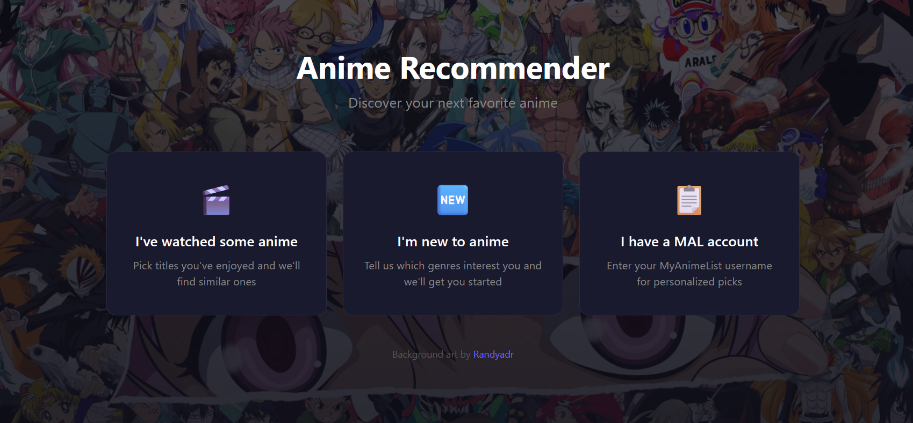
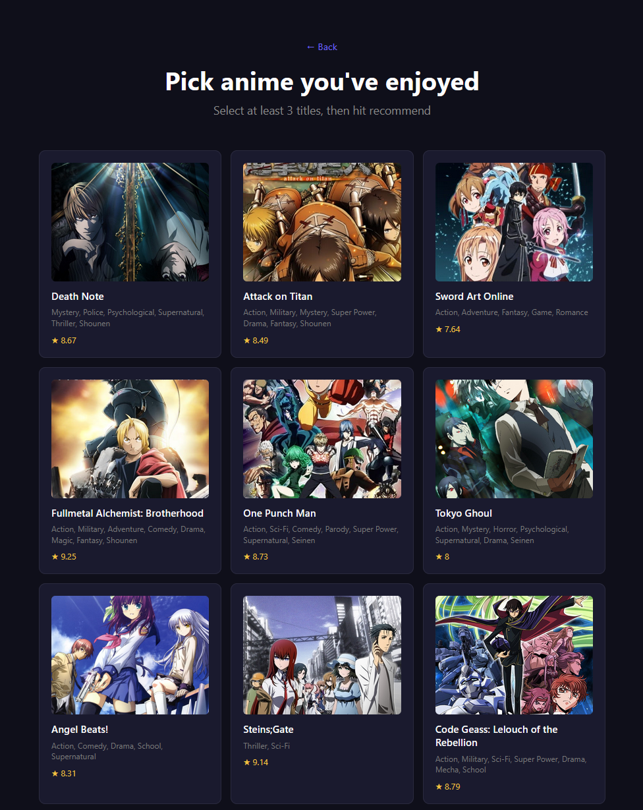
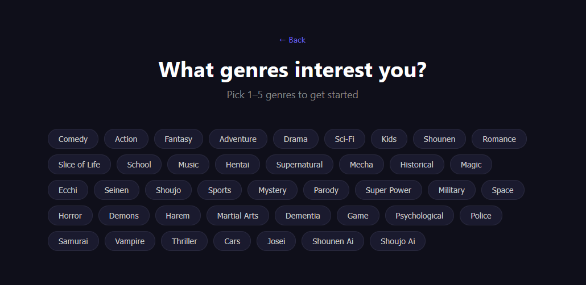
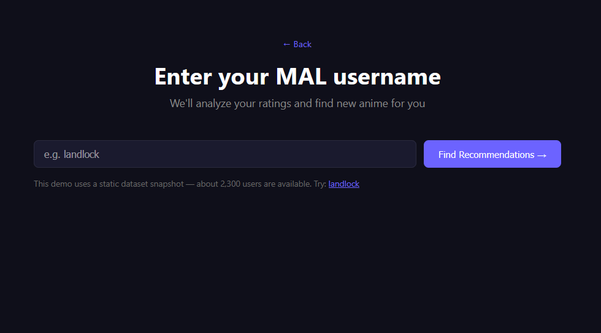
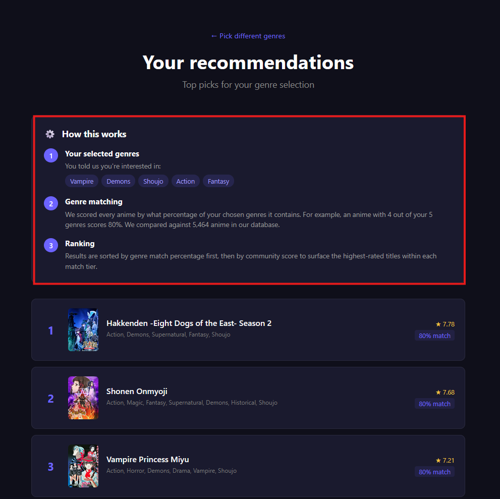
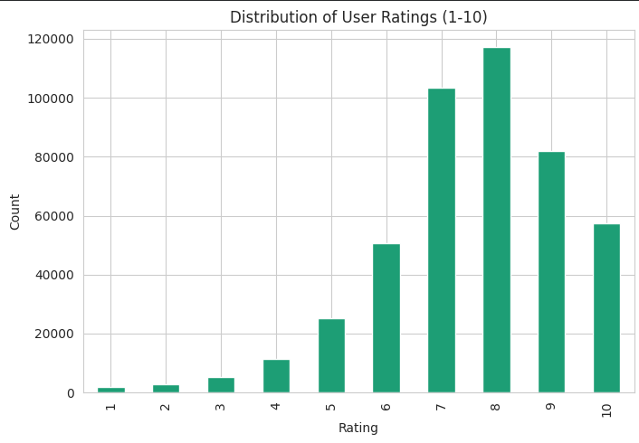
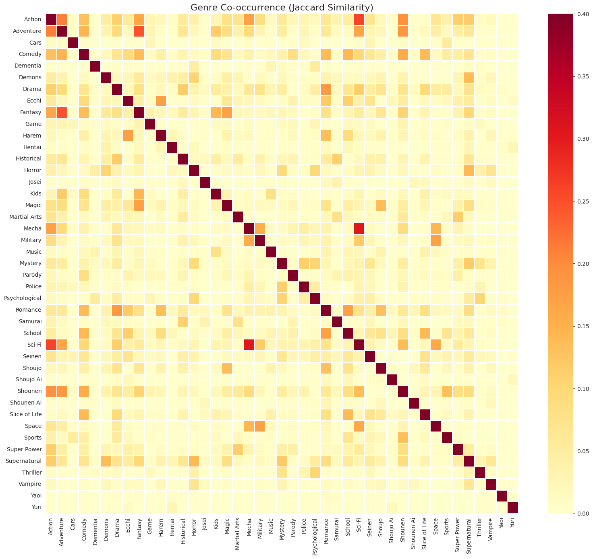
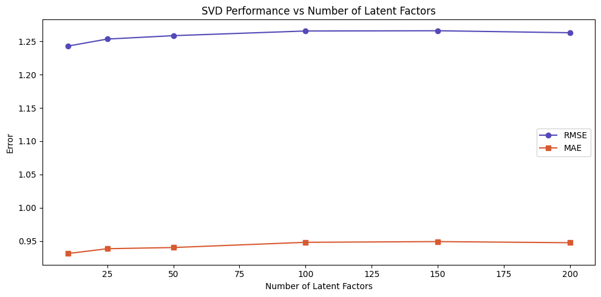

# MyAnimeList Recommender Application
Developed a recommendation system for MyAnimeList (MAL - https://myanimelist.net/) to replace the need for manually searching for new titles. Users can find new anime based on titles they have watched, genre's they find interesting or even using their MAL username through a light web application. This repo serves as a showcase of the product and my logic to build it. It is only a demo using a static snapshot of the MAL database.

[Try the live demo here!](https://mal-recommender.onrender.com/)

---

## The Problem
MyAnimeList hosts 14k+ anime titles, but discovering new shows is a laborious task. I ran into this issue myself, as I'd find myself constantly clicking through other user's profiles, checking what they have watched and enjoyed before checking what they are recommending. Even then, there is a chance I can completely dislike the anime I find after all that searching. There had to be hidden patterns in the shows that people enjoy, and the kind of shows they gravitate towards. So I thought, why not put my data science skills to use and build a neater recommendation engine for a website that is all about discovering new anime!

---

## The Product
The application offers three different paths to get recommendations, each designed for a different type of user:

### 🎬 "I have seen some anime"

Users select titles that they enjoyed from a visual grid of popular anime. The system builds a genre fingerprint from their selections and finds the most similar titles using cosine similarity on one-hot encoded genre vectors.

### 🆕 "I am new to anime"

For cold-start users with no watch history but have preferences for genres. The system scores every anime by genre match percentage, ranked by community rating within each match tier.

### 📋 "I have an MAL account"

Users enter their MAL username, and the system analyzes their rating history to generate a hybrid recommendation that combines collaborative filtering with content-based signals.

### Transparent Recommendations

It's useful for a user to know why something is being suggested to them. Every results page includes an explainer card showing users exactly how their recommendations were generated. It shows the model, the data used, and why each title was selected.

---

## The Data Science

### Dataset
Built on the [MyAnimeList Kaggle dataset](https://www.kaggle.com/datasets/azathoth42/myanimelist): **14,000+ anime**, **300,000 users**, and **80 million ratings**. After cleaning (removing unrated entries, filtering by activity thresholds, dropping unaired titles), the working dataset contains **2,337 active users**, **2,460 anime**, and **457,000 ratings** at **92% sparsity**.

### Exploratory Analysis
**Rating distribution** - MAL ratings cluster heavily around 7–8 with a mean of 7.59. Users overwhelmingly rate things they liked, creating a strong positive skew. This motivated per-user mean centering for the collaborative filtering models.

**Genre co-occurrence** - Genres like Sci-Fi/Mecha and Shounen/Action are tightly coupled, while others like Romance/Mecha almost never co-occur. The co-occurrence structure confirmed that raw one-hot genre vectors capture meaningful similarity for content-based filtering.

**Activity distributions** - Both users and anime follow a power-law distribution. A small number of blockbuster titles and power users account for a disproportionate share of ratings. This popularity bias is a key reason for using a hybrid approach — collaborative filtering alone over-recommends popular titles.

### Model Comparison
 
I evaluated four approaches systematically, and experimented with their parameters to identify the best model:
 
| Model | RMSE | MAE | Key Finding |
|-------|------|-----|-------------|
| Content-Based (Cosine Similarity) | N/A (ranking) | N/A | Strong for genre matching, but can't capture behavioral patterns |
| SVD (100 factors) | 1.2657 | 0.9480 | Solid baseline collaborative filtering |
| **SVD (10 factors) ★** | **1.2430** | **0.9311** | **Best accuracy — fewer factors outperformed more** |
| NMF (100 factors, no bias) | 2.9162 | 2.3996 | Failed without bias correction on skewed data |
| NMF (30 factors, biased) | 1.2856 | 0.9685 | Bias terms recovered most of the gap |
| Hybrid v1 (score blending) | 2.1091 | — | Naive blending made results *worse* |
| Hybrid v2 (rank fusion) | N/A (ranking) | N/A | Best recommendation diversity |

### Key Findings
 
**1. Fewer latent factors beat more.** SVD with just 10 factors achieved the lowest RMSE (1.243), outperforming models with 100, 150, and 200 factors. The effective dimensionality of anime taste is surprisingly low.

**2. Bias correction is essential for skewed data.** NMF without bias terms failed badly (RMSE 2.92) because MAL ratings cluster around 7–8. Without learning each user's and anime's baseline tendency, NMF couldn't account for this shift. Adding `biased=True` brought it within 0.04 of SVD.
 
**3. Naive score blending hurts accuracy.** My first hybrid approach mixed calibrated SVD predictions (1–10 scale) with uncalibrated cosine similarity scores (0–1 scale). Even after normalization, the hybrid RMSE (2.11) was far worse than pure SVD (1.19). The problem is that we can't meaningfully average two fundamentally different quantities.
 
**4. Rank fusion solved the blending problem.** Instead of blending scores, I converted each model's output to percentile ranks, then blended those (70% collaborative, 30% content-based). This respects each model's strengths without forcing them onto the same scale and successfully surfaces niche quality titles that neither approach finds alone.
 
---
 
## Tech Stack
 
- **Data analysis & modeling:** Python, pandas, NumPy, scikit-learn, scikit-surprise, matplotlib, seaborn
- **Backend:** Flask, custom SVD prediction (extracted model parameters, no runtime Surprise dependency)
- **Frontend:** HTML, CSS, JavaScript
- **Cover art:** Jikan API (unofficial MyAnimeList API) with on-demand fetching and caching
- **Deployment:** Render
---

## Future improvements
- **Better franchise deduplication:** the current 2-word heuristic misses cases like "Fullmetal Alchemist" vs "FMA: Brotherhood". Furthemore, it 
- **Richer content features:** incorporate studio, source material, and synopsis text (via TF-IDF or embeddings) beyond just genres
- **Live MAL integration:** use the Jikan API to fetch any user's current ratings instead of relying on a static dataset snapshot
- **A/B testing different alpha weights:** the 70/30 CF/CB split was chosen heuristically; user feedback could optimize this
---

## About
 
Built by **Viswas Mandalika** - Data Analytics Engineering Graduate student @ Northeastern University, Boston, MA
This product demonstrates end-to-end data science: exploratory analysis, model selection and evaluation, productionization, and deployment. 
The full analytical methodology in a detailed Jupyter notebook covering data cleaning, EDA, and model comparison can be found in the [Jupyter Notebook](LINK) in this repo.

